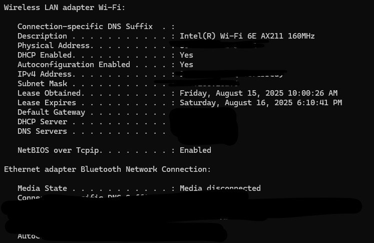
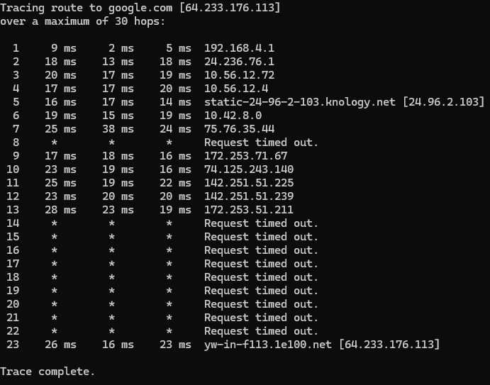
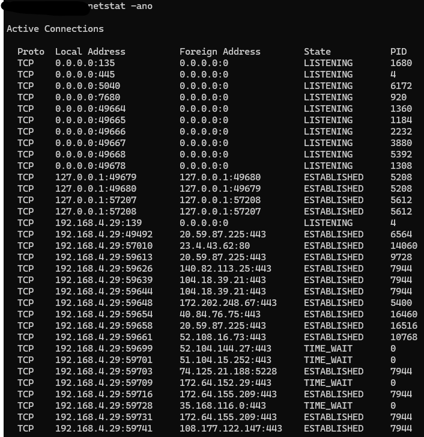

# CMD Network Troubleshooting Guide
This guide demonstrates how to use basic **Command Prompt (CMD) network commands**
## 1. Open Command Prompt
- Press **Windows Key + R**
- Type 'cmd' then **Enter**
- 
---
## 2. Check Your IP Configuration
- Open Command Prompt
- Type 'ipconfig /all' then **Enter**
- Displays IP address, Subnet mask, Default Gateway, DNS Servers.
- 
  
  ---
## 3. Test Connectivity with Ping
- Open Command Prompt
- Type ping google.com
- This confirms if your computer can reach the internet.
- Replies mean it is working, timeouts mean a problem
  

---
## 4. Trace the Route to a Website
- Open Command Prompt
- Type tracert google.com
- This shows the "hops" meaning how many hops it takes data to reach destination.
- Helps identify where delays or blocks happen.
- Screenshot:

---
## 5. Test DNS Resolution
- Open Command Prompt
- Type nslookup google.com
- Displays which DNS server is being used.
- Shows the resolved IP address for the domain.
- Screenshot:

## 6. View Active Network Connections
- Open command prompt
- Type nestat -ano
- Lists active connections, listening ports, and process IDs.
- Help detect open connections or suspicious activity.
- Screenshot:

---
## 7. Flush and Renew IP Address
- Open Command Prompt
- Type ipconfig /release (this releases the current IP)
- Screenshot: 
- Then type ipconfig /renew (this fixes issues with DHCP and IP conflicts)
- Screenshot:

## 8. Clear DNS Cache
- Open Command Prompt
- Type ipconfig /flushdns
- This clears stored DNS entries and helps resolve issues when sites fail to load properly.
- Screenshot:

